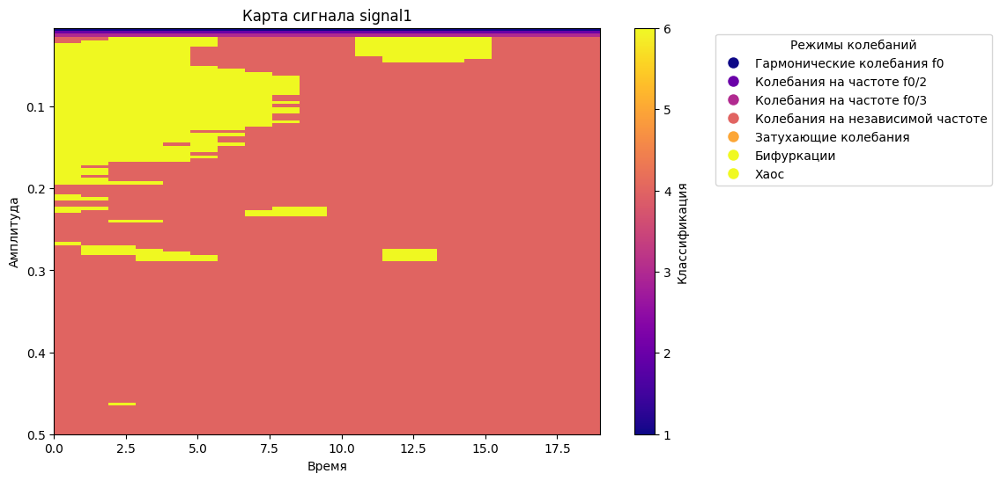

# wavelet

Проект для анализа сигналов с использованием вейвлет-преобразования и классификации частот

## Содержание
1. [Установка](#установка)
   1. [Установка Python 3](#установка-python-3)
   2. [Установка зависимостей](#установка-зависимостей)
2. [Запуск программы](#запуск-программы)
   1. [Дополнительная настройка](#дополнительная-настройка)
3. [Структура проекта](#структура-проекта)
   1. [Пример данных для signal.csv](#пример-данных-для-signalcsv)
   2. [Пример частотной карты сигнала](#пример-частотной-карты-сигнала)

## Установка

Для работы с проектом необходимо использовать Python 3. 
Убедитесь, что у вас установлен Python 3. 
Если нет, следуйте инструкциям для вашей операционной системы:

### Установка Python 3

- **Для Windows:** Загрузите установочный файл с [официального сайта Python](https://www.python.org/downloads/windows/) 
  и следуйте инструкциям
- **Для macOS:** Используйте [Homebrew](https://brew.sh/) для установки:
  ```bash
  brew install python
  ```
- **Для Linux (Ubuntu/Debian):**
  ```bash
  sudo apt update
  sudo apt install python3 python3-pip
  ```

### Установка зависимостей
После установки Python 3, установите все необходимые библиотеки, используя `pip`. 
В директории проекта создайте файл `requirements.txt` с перечнем зависимостей. 
Установите все библиотеки с помощью следующей команды:

```bash
pip3 install -r requirements.txt
```

## Запуск программы

Для запуска программы выполните следующую команду:

```bash
python3 main.py
```

### Дополнительная настройка
Можно настроить поведение программы с помощью переменных окружения: 
1. `SAVE_PLOT` - если она установлена в `True`, график будет сохранен в файл, иначе он будет отображен в интерактивном режиме.
Это позволит сохранить график как изображение в папке `.maps/`, используя имя сигнала в качестве имени файла.
2. `LOAD_CLASSIFICATION_MAP` - пересчитывать карту классификации частот или загрузить ее из промежуточного файла без пересчета

Пример:
```bash
export SAVE_PLOT=True  # Для Linux/Mac
set SAVE_PLOT=True     # Для Windows
python3 main.py
```

## Структура проекта
- `reader.py`: чтение сигналов из CSV-файла
- `wavelet_transformer.py`: выполнение вейвлет-преобразования
- `frequency_classifier.py`: классификация частот на основе вейвлет-преобразования
- `plot.py`: построение карты частотных классов
- `main.py`: файл для запуска проекта

### Пример данных для `signal.csv`
Файл `signal.csv` должен содержать временные ряды сигналов. Пример данных:
```csv
0.0,0.1
0.1,0.2
0.2,0.4
0.3,0.6
```

### Пример частотной карты сигнала

